# SIA

## Web App
**Repo:** https://github.com/jumorap/sia_wa
- Run `npm install` to install all dependencies.
- Run `npm start` to start the app.

**Docker:** https://hub.docker.com/r/jumorap/sia_wa
- Run `docker run -p 3800:3800 jumorap/sia_wa` to start the app.

## Mobile App
**Repo:** https://github.com/jumorap/sia_ma
- Run `npm install` to install all dependencies.
- Run `npx react-native run-android` to start the app.

## Gateways in Docker
### Academic AG:
**Repo:** https://github.com/paulinoacuna/sia_academica_ag
- Run `npm install` to install all dependencies.
- Run `npm start` to start the app.

**Docker:** https://hub.docker.com/r/ycuervob/sia_academica_ag
- Run `docker run -p 4001:4001 ycuervob/sia_academica_ag` to start the gateway.

### General AG:
**Repo:** https://github.com/jumorap/sia_ag
- Run `npm install` to install all dependencies.
- Run `npm start` to start the app.

**Docker:** https://hub.docker.com/r/ycuervob/sia_general_ag
- Run `docker run -p 4000:4000 ycuervob/sia_general_ag` to start the gateway.

## Interface
**Repo:** https://github.com/jlizarazoa/asignaturas_interface
- Run `npm install` to install all dependencies.
- Run `npm start` to start the app.

## Microservices
### Session MS:
**Docker:** https://hub.docker.com/r/ycuervob/sia_session
- Run `docker run -d -p 27018:27017 --name sia_session_db -v (LOCAL_FOLDER):/data/db -e MONGO_INITDB_DATABASE=sia_session mongo` to start the DB.
- RUN `docker run -d -p 3000:3000 --name sia_session_ms --network=sia ycuervob/sia_session:complete` to start the microservice.

### Info_Personal MS:
**Docker** https://hub.docker.com/r/jumorap/sia_info_personal_ms (Rust with local DB)
- Run `docker run -p 8000:8000 --name sia_info_personal_ms jumorap/sia_info_personal_ms` to start the microservice.

**Docker** https://hub.docker.com/r/jumorap/sia_info_personal2_ms (Python)
- Run `docker run -p 8000:8000 --name sia_info_personal_ms jumorap/sia_info_personal2_ms` to start the microservice.

### Calificaciones MS:
**Docker** https://hub.docker.com/r/jsla114/sia_calificaciones_ms
- Run `docker run -p 8000:8000 --name sia_calificaciones_ms jsla114/sia_calificaciones_ms:ms` to start the microservice.

### Inscripciones MS:
**Docker** https://hub.docker.com/r/jorodriguezal/sia_inscripciones_ms
- Run `docker run -p 4000:4000 -e URL=0.0.0.0:4000 --name sia_inscripciones_ms jorodriguezal/sia_inscripciones_ms` to start the microservice.

### Buscador Cursos MS:
**Docker:** https://hub.docker.com/r/jleonro/architecture2022
- Run `docker run -p 4100:4000 --name sia_buscador_cursos_ms jleonro/architecture2022` to start the microservice.

### Info_Academica MS:
**Docker** https://hub.docker.com/r/paulinoacuna/2e_infoacademica_ms
- Run `docker run -p 8080:8080 --name sia_info_academica_ms paulinoacuna/2e_infoacademica_ms` to start the microservice.

## Reverse Proxy
**Docker:** https://hub.docker.com/r/jleonro/reverse_proxy
- Run `docker run -p 80:80 --add-host=host.docker.internal:host-gateway -d --name proxy jleonro/reverse_proxy` to start the reverse proxy.

# Screenshots

## Architecture
### Capas: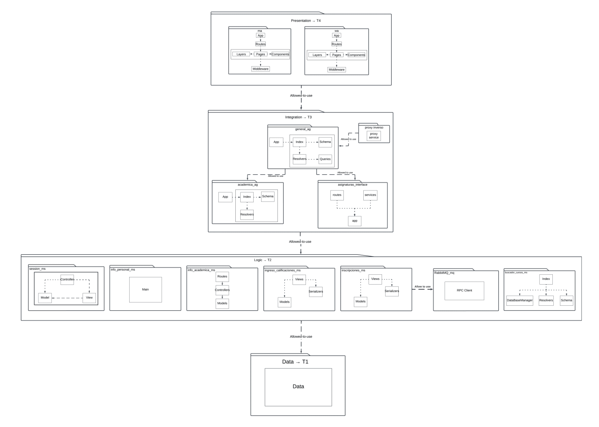
### Componentes y Conectores: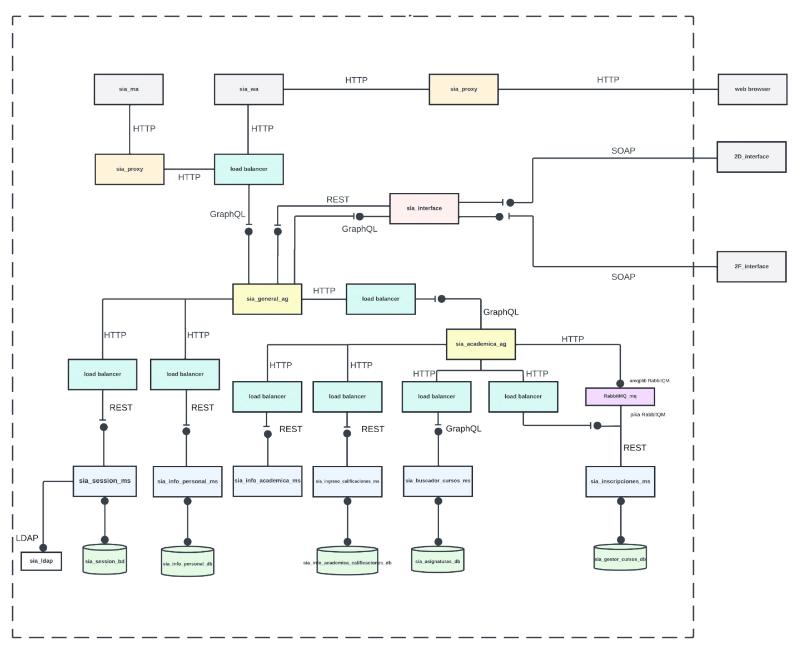
### Descomposición: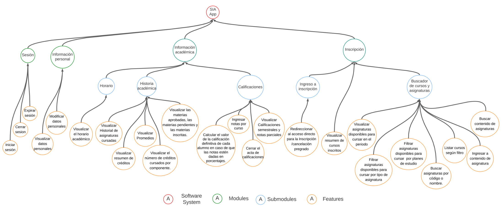
### Despliegue: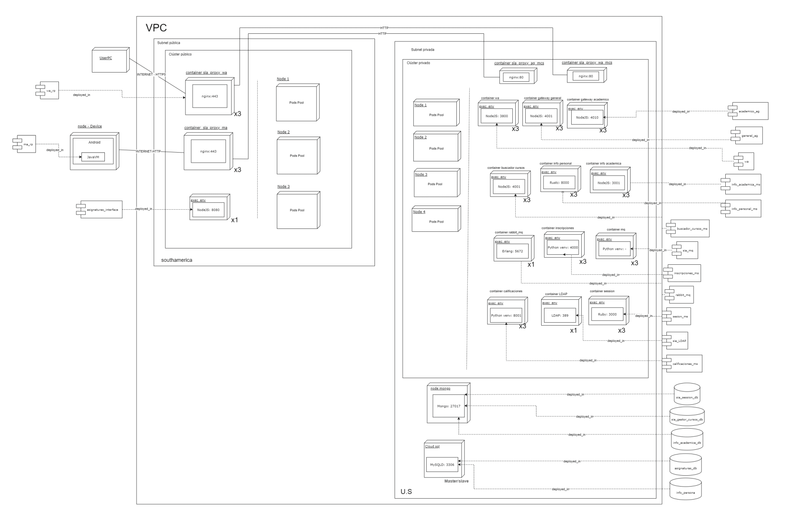
### Modelo de Datos: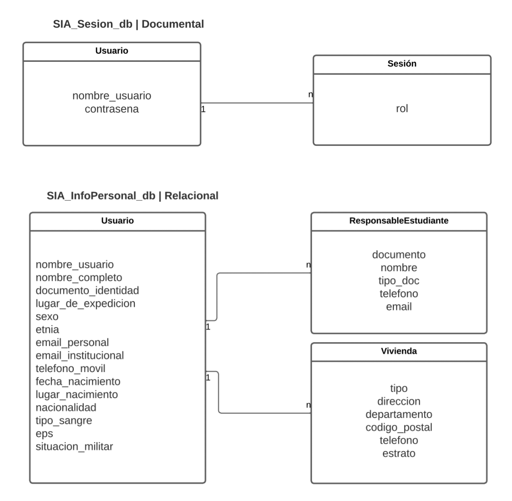
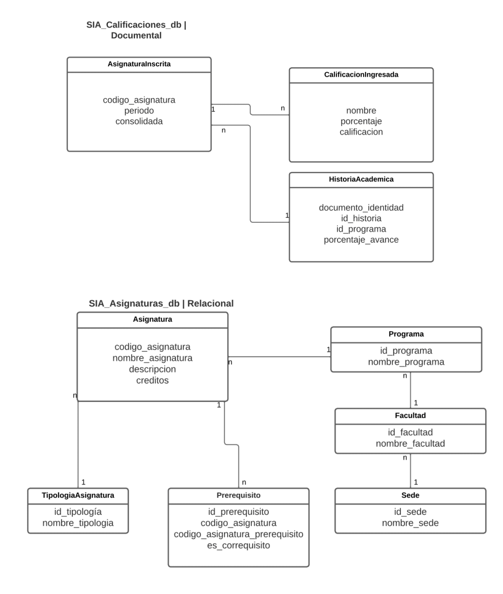
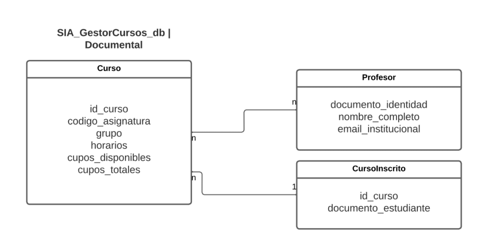

## GCP
### Ingress and Services: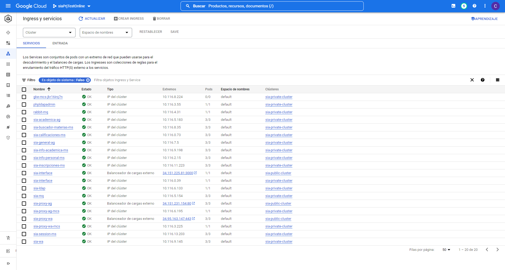
### CloudSQL: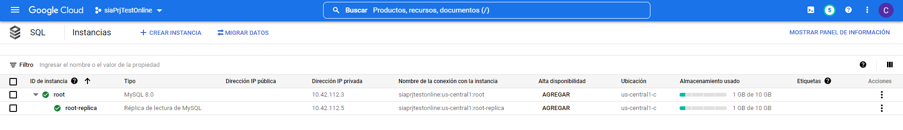

## Web App
### Login  page: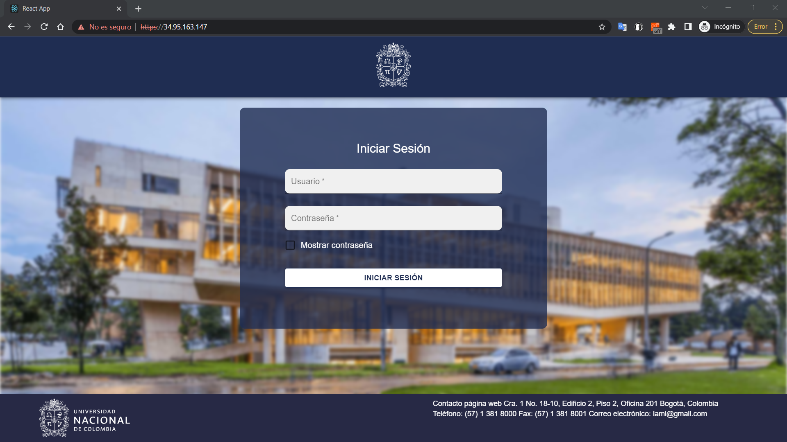
### Starting page:
### Info Personal page: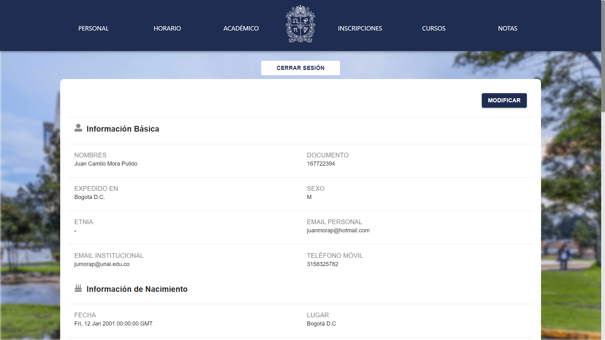
### Horario page: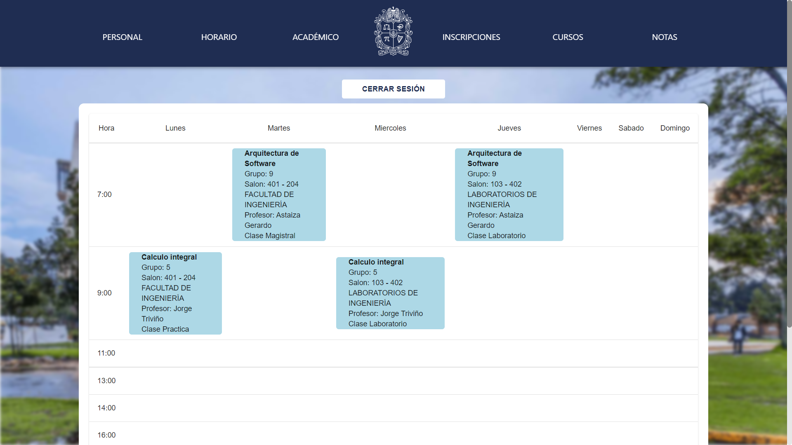
### Info Académica page: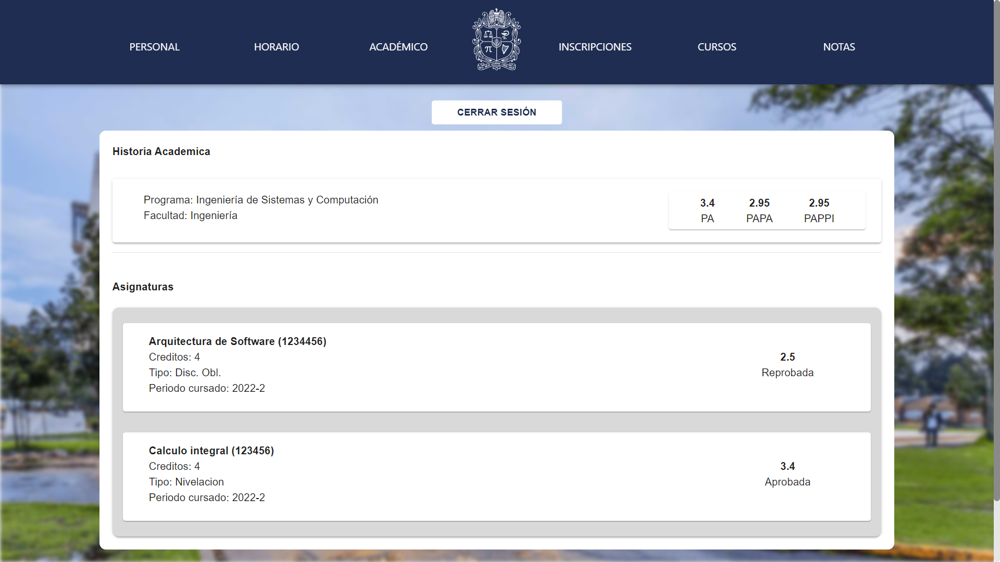
### Inscripciones page: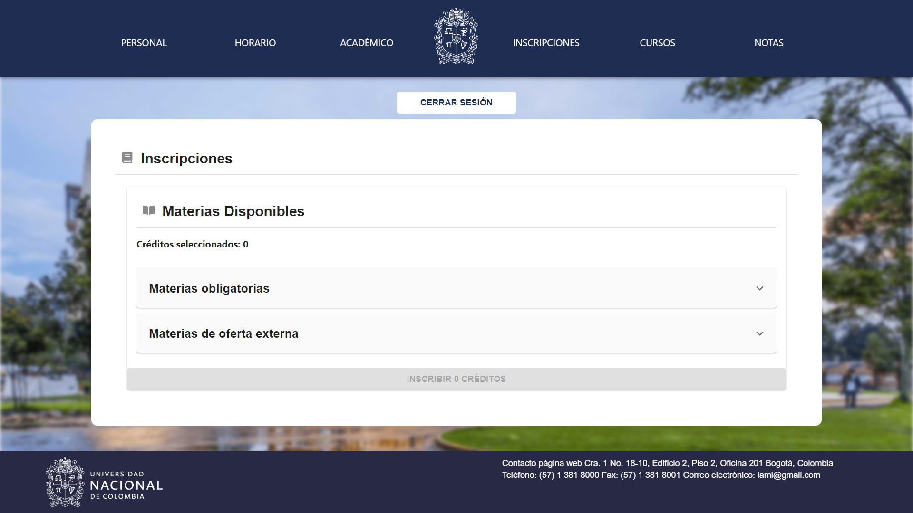
### Buscador de cursos page: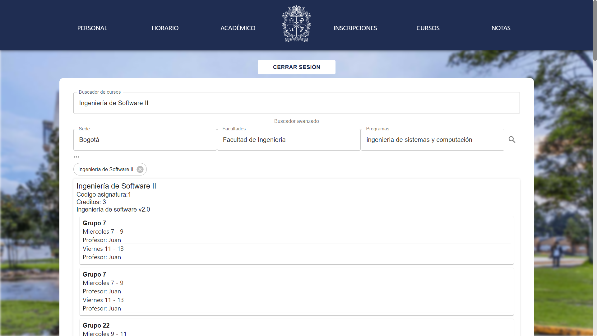
### Calificaciones page: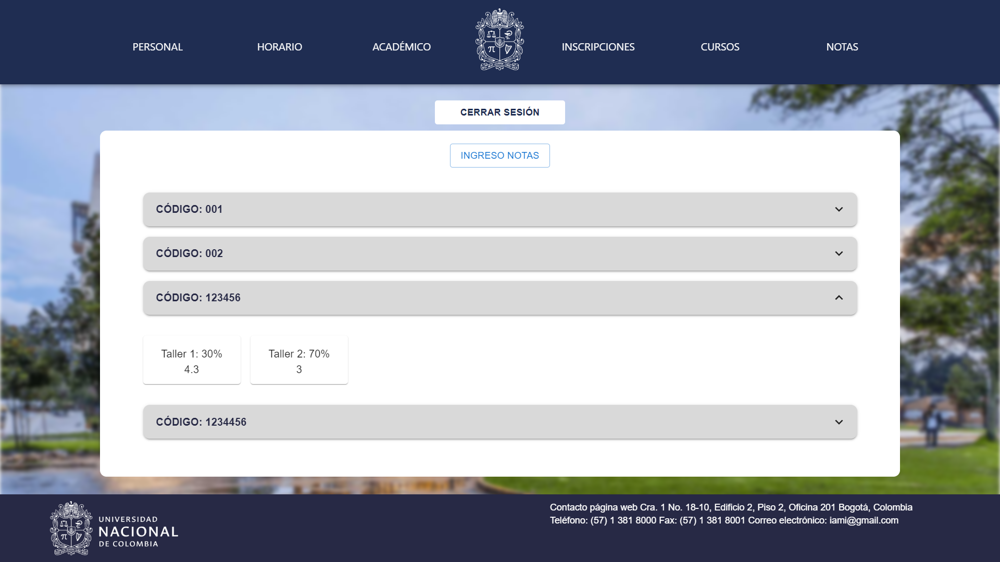
### Agregar Calificaciones page: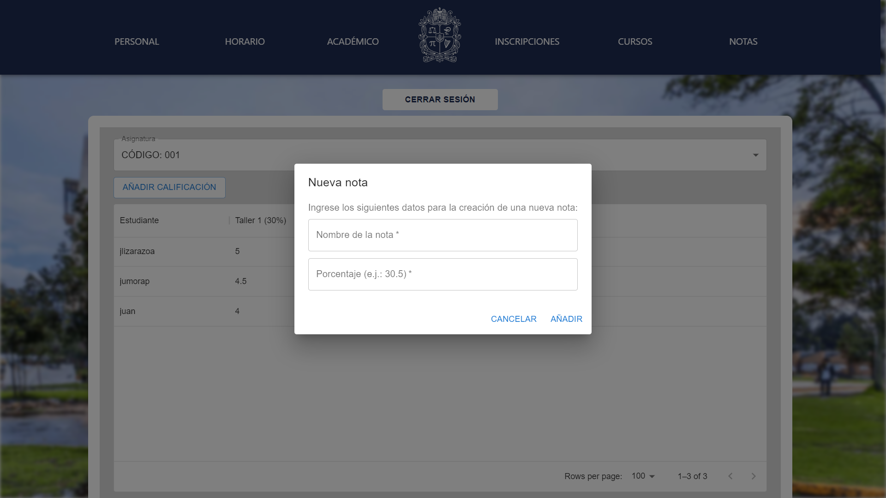

